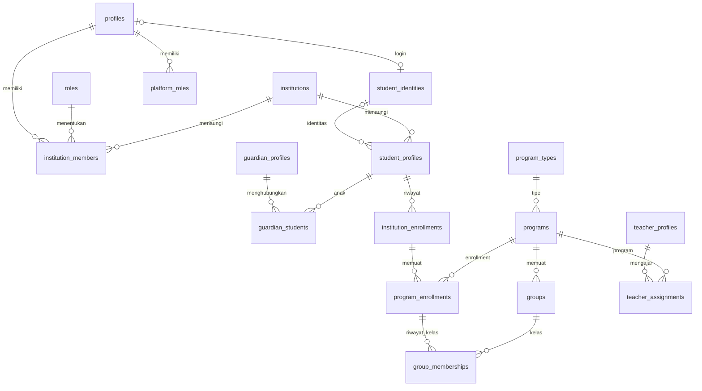

# Operasi backend foundation

## Urutan migrasi

| Versi | Isi |
|---|---|
| 20260923000100 | private schema, auth profile trigger/backfill, institution, roles, membership, platform roles |
| 20260923000200 | global student identity, local people profiles, guardian relationship |
| 20260923000300 | program types + seed, program, class, enrollment hierarchy, assignments |
| 20260923000400 | immutable ownership/history, live parent checks, audit, metadata |
| 20260923000500 | role/assignment/relationship RLS dan column grants |
| 20260923000600 | command atomik, verification stamp, indexes, soft delete, status lembaga |
| 20260924000700 | enrollment sementara/liburan, jadwal masa berlaku, ENDED, penutupan hierarki, worker expiry, guard/RLS waktu |

Migrasi direplay sekali dalam urutan nama pada database bersih. Supabase menyimpan versi migrasi yang sudah diterapkan; SQL `CREATE TABLE` tidak dimaksudkan dieksekusi dua kali pada schema yang sama. Replay pada database baru diuji. Reference seed masuk migrasi agar tidak hilang saat deployment tanpa development seed.

Selama pengerjaan, perbaikan dilakukan pada enam migrasi yang belum dirilis dan diuji ulang dari database kosong. Setelah dirilis, jangan edit migrasi lama: buat forward migration baru.

## Bootstrap operator platform

1. Terapkan migrasi ke lingkungan development/staging kosong.
2. Buat akun operator menggunakan Supabase Auth. Trigger otomatis membuat `profiles`; metadata `role` pengguna tidak memberi izin.
3. Operator database tepercaya memverifikasi pemilik akun, lalu memberikan `platform_roles` untuk profile yang benar. Tidak ada Super Admin default yang di-seed.
4. Login sebagai operator tersebut; panggil `create_institution` dengan profile admin pertama yang sudah diverifikasi.

Contoh SQL provisioning parameterized, dieksekusi **hanya server/operator tepercaya** (parameter `$1` adalah auth UUID terverifikasi):

```sql
insert into public.platform_roles(profile_id,role_code)
select id,'SUPER_ADMIN' from public.profiles
where auth_user_id=$1 and is_active and deleted_at is null;
```

Perubahan role tercatat oleh trigger audit. Server dengan service credential tidak otomatis dianggap actor end-user: bila tidak ada JWT user, audit mencatat actor NULL/SYSTEM. Jangan mengisi actor palsu dari payload client.

## Provisioning membership dan identity

Pembuatan membership serta pengaitan `student_identities.profile_id`, `student_profiles.student_identity_id`, dan login wali memerlukan verifikasi server. Fase ini sengaja tidak menyediakan RPC client yang menerima UUID global lalu langsung mengaitkannya.

Server melakukan pemeriksaan identitas terlebih dahulu, kemudian transaction untuk membership + profile lokal/link terkait. Semua perubahan tetap melalui constraints dan audit. Trigger memeriksa membership TEACHER/GUARDIAN sebelum profile aktif yang terhubung login dapat digunakan. Student tanpa login tetap bisa mempunyai record lokal; guardian tanpa login memakai `profile_id = NULL`.

Untuk guardian-student linking, admin lembaga dapat membuat PENDING dan mengubah menjadi VERIFIED setelah verifikasi yang sah. Database mencatat actor dan waktu verifikasi sebenarnya. REVOKED atau `can_view_progress=false` segera menutup akses anak. Bukti/transport verifikasi (undangan, email, nomor telepon) adalah workflow berikutnya, belum ada di foundation.

## Matriks akses

| Role | Scope baca | Mutasi client |
|---|---|---|
| Anon | Tidak ada tabel foundation | Tidak ada |
| User aktif tanpa membership | Profil sendiri dan reference program/role | Kolom profil pribadi yang diizinkan |
| Admin Lembaga | Data tenant sendiri dan audit tenant | Struktur lokal, status membership, link wali; bukan global account binding |
| Ustaz | Assignment aktif dan santri pada program/kelas yang ditugaskan | Profil pribadi; tidak mengubah struktur kelas |
| Wali | Anak dari link VERIFIED + permission + membership aktif | Profil pribadi |
| Santri | Record sendiri dalam konteks membership yang sah | Profil pribadi |
| Super Admin | Lembaga/membership untuk administrasi dan audit global | Command platform; tanpa SELECT bebas data santri lintas tenant |
| Server tepercaya | Sesuai tanggung jawab server, BYPASSRLS bawaan Supabase | Provisioning/verifikasi; credential wajib server-only |

Izin beberapa role digabung berdasarkan membership yang benar. Contoh ustaz di A sekaligus wali di B memperoleh kedua scope yang sah, tanpa membuka roster B.

Akses operasional memerlukan lembaga ACTIVE/TRIAL, profile login aktif, serta role membership aktif. Assignment memperhitungkan tanggal, status program/kelas, dan enrollment aktif. Menutup enrollment menghilangkan santri dari jalur akses roster ustaz; santri/wali yang tetap berwenang dapat membaca history.

## History dan soft delete

- Tidak mengubah `institution_id`, owner relationship, program/class milik history untuk melakukan transfer.
- Pindah kelas: `move_student_group`; transaction mengunci program enrollment dan menutup row lama.
- Transfer/lulus: tutup enrollment lama, buat enrollment baru. Closed enrollment read-only; koreksi historis khusus belum dibuka.
- Soft delete melalui command allowlist. SELECT tidak membuka deleted rows, bahkan bagi admin. Tidak ada client hard-delete atau truncate.
- FK memakai RESTRICT, tanpa cascade pendidikan. Audit append-only dan tidak dapat dimutasi melalui grant client/service_role biasa.
- Restore entity nonhistory hanya melalui server tepercaya, setelah memeriksa parent aktif dan uniqueness. Audit mencatat RESTORE.

## Struktur relasi



## Gate sebelum staging/production

Jalankan Supabase lokal dengan Docker, replay migrasi, matriks native, dan smoke test Auth/JWT/PostgREST. Pemeriksaan embedded tidak membuktikan konfigurasi gateway atau lifecycle session Supabase. `config.toml` memakai PostgreSQL 17; mesin embedded yang diuji PostgreSQL 18.3. SQL tidak memakai fitur eksklusif PostgreSQL 18, tetapi kesesuaian native tetap harus dibuktikan.

Staging harus menggunakan project terpisah dan data sintetis. Setelah project tujuan tersedia, periksa migration history dan dry-run sebelum push. Jangan reset remote, menjalankan fixture pada production, atau mengubah schema produksi manual.

## Recovery

Jika migrasi gagal, simpan error dan versi terakhir; jangan menumpuk migrasi di atas kegagalan yang belum dipahami. Gunakan transaction dan ulangi dari lingkungan dev kosong. Untuk environment berisi data, lakukan backup terlebih dahulu dan forward fix yang direview. Tidak ada down migration destruktif otomatis. Backup/restore production belum diuji pada fase lokal ini.

## Langkah berikutnya

Checkpoint migrasi 7 selesai di embedded. Lihat `../TEST_REPORT.md`. Jangan memulai milestone berikutnya sebelum hasil checkpoint dilaporkan kepada pengguna.

Selesaikan gate Supabase lokal/staging sebelum menyebut foundation siap rilis. Sesudah gate itu, fase berikutnya yang disarankan adalah Quran reference untuk tracking serta konfigurasi Tahfiz/Quran Reading melalui migrasi baru, dengan persetujuan scope terpisah. Jangan otomatis membangun UI atau fitur lainnya.

## Temporary / holiday enrollment

- Tambahkan enrollment di lembaga tujuan menggunakan profil lokal yang ditautkan ke identity existing setelah verifikasi. Jangan membuat akun baru atau menutup enrollment asal.
- Pilih REGULAR, TEMPORARY, atau HOLIDAY. Dua tipe terakhir wajib memiliki started_at dan scheduled_end_at. Contoh belajar 1–10 Juli: started_at=1 Juli, scheduled_end_at=11 Juli. Tanggal mengikuti timezone lembaga.
- ended_at bukan jadwal; pada ENDED, database mengisinya dengan tanggal penutupan aktual. Audit memiliki timestamp proses. Scheduler terlambat dapat menghasilkan ended_at setelah scheduled_end_at; akses operasional sudah berhenti pada batas jadwal.
- `end_institution_enrollment(enrollment_id, closure_reason)` hanya untuk admin tenant terkait. Aman diulang untuk record ENDED dan menutup program/class turunannya secara atomik. Direct authorized UPDATE menjadi ENDED juga mengikuti trigger yang sama. Pembatalan sebelum tanggal mulai tetap mencatat tanggal pemrosesan sebenarnya.
- Role WALI/USTAZ yang masih sah tidak dicabut. Histori dibaca berdasarkan izin pribadi/wali/admin yang masih berlaku. Role ganda tidak memberi ADMIN otomatis.
- Perubahan jadwal yang sah dilakukan sebelum kedaluwarsa. Setelah ENDED, history read-only; liburan berikutnya membuat record baru.
- Timezone tidak boleh diganti ketika masih ada enrollment terjadwal PENDING/ACTIVE yang belum soft-deleted. Migration menolak timezone existing tidak valid; perbaikan datanya perlu diperiksa operator sebelum retry.

## Worker expiry — siap dipanggil, belum dijadwalkan pada runtime

Server tepercaya dapat menjalankan `select public.expire_institution_enrollments(100);` sebagai service_role. Fungsi memproses sampai 100 enrollment jatuh tempo per panggilan, memakai row lock + SKIP LOCKED, mengembalikan jumlah yang ditutup, serta menerima batch 1–1000. Jalankan ulang sampai antrean habis. Retry tidak menggandakan penutupan/audit. Actor tanpa JWT dicatat SYSTEM.

Tidak ada execute grant bagi authenticated/anon. Jangan mengekspos service credential ke client. Saat milestone Supabase lokal dimulai, pasang pemanggilan periodik oleh scheduler tepercaya dan uji batch, kegagalan/retry, serta concurrency dengan perpindahan kelas. Tidak ada cron/job eksternal yang dibuat pada checkpoint migrasi 7 ini.

RLS mengevaluasi tanggal saat statement dijalankan, bukan waktu client. Worker tetap diperlukan untuk memperbarui status tersimpan menjadi ENDED dan membebaskan slot enrollment aktif; keterlambatannya tidak membuka akses roster atau mutasi program/class setelah periode berakhir.
